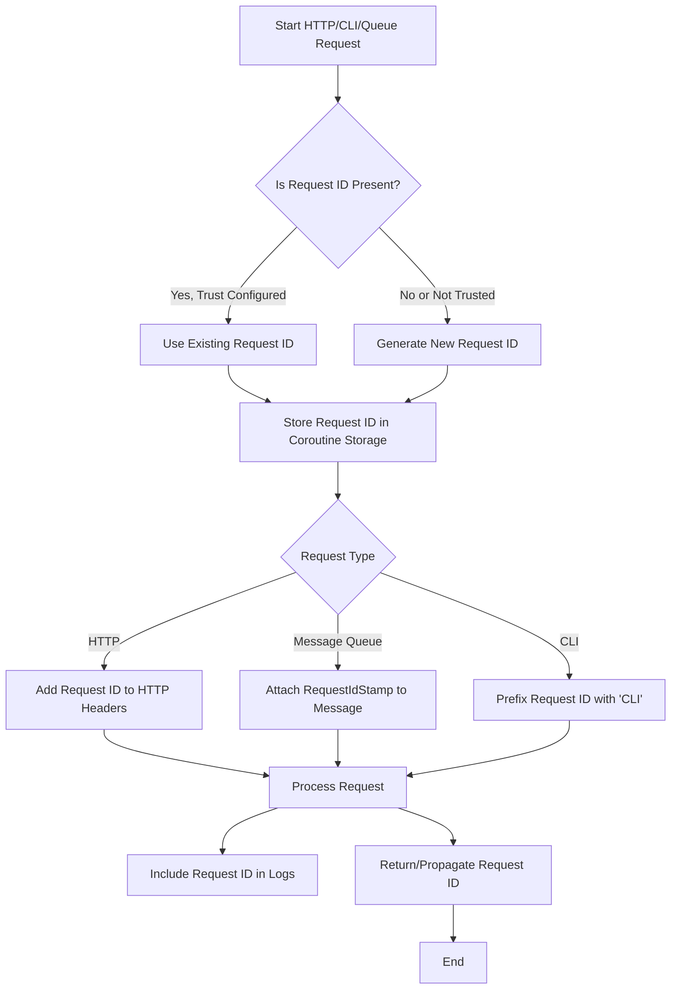

# RequestIdBundle Workflow

## 详细说明

### 请求 ID 生成流程

1. **请求入口判断**：
   - 系统接收到 HTTP 请求、CLI 命令或消息队列消息
   - 检查是否已存在请求 ID
   - 若配置为信任请求 ID 且 ID 存在，则复用该 ID
   - 若不存在或不信任，则生成新的 UUID（Base58 编码）

2. **存储机制**：
   - 使用协程安全的 `RequestIdStorage` 存储请求 ID
   - 每个请求上下文独立存储，互不干扰
   - 请求结束时自动清理，防止内存泄漏

3. **根据请求类型的处理**：
   - **HTTP 请求**：`RequestIdSubscriber` 自动将 ID 添加到响应头
   - **消息队列**：`RequestIdMiddleware` 添加 `RequestIdStamp` 到消息中
   - **CLI 命令**：`CommandRequestIdSubscriber` 为 ID 添加 "CLI" 前缀

4. **日志集成**：
   - `RequestIdProcessor` 自动将请求 ID 添加到日志记录的 `extra` 字段
   - 所有日志记录都包含请求 ID，方便追踪和关联

### 组件协作

- **RequestIdStorage**：协程安全的存储服务，负责存取当前请求 ID
- **RequestIdGenerator**：生成基于 UUID Base58 的唯一请求 ID
- **RequestIdSubscriber**：处理 HTTP 请求的请求 ID 注入和提取
- **CommandRequestIdSubscriber**：为 CLI 命令添加请求 ID
- **RequestIdMiddleware**：在消息队列中传递请求 ID
- **RequestIdProcessor**：将请求 ID 集成到日志系统

### 使用场景

1. **分布式系统追踪**：
   - 多服务间调用可通过请求 ID 关联
   - 在微服务架构中追踪完整请求链路

2. **日志聚合分析**：
   - 通过请求 ID 筛选特定请求的所有日志
   - 快速定位生产环境中的问题

3. **性能监控**：
   - 使用请求 ID 关联性能数据
   - 分析特定请求的执行时间和资源消耗

4. **调试支持**：
   - 开发环境中通过请求 ID 跟踪请求流程
   - 简化复杂系统的调试过程
